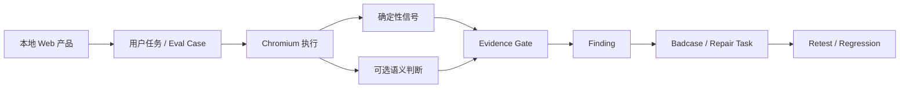
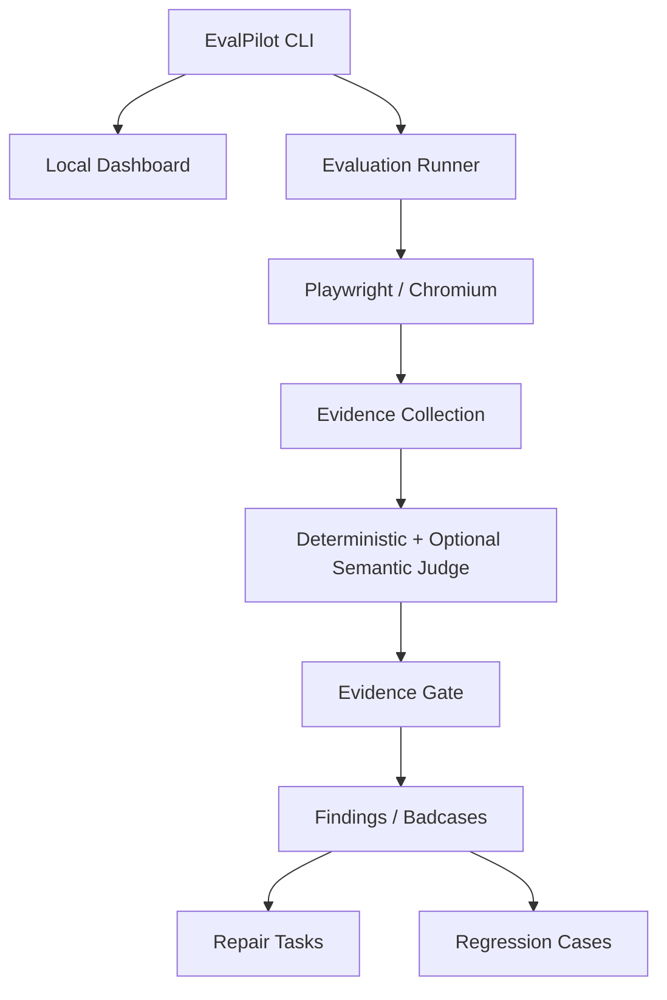
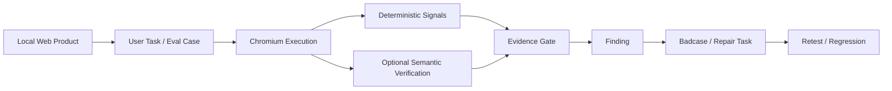

# EvalPilot Local — 本地优先、证据优先的 Web 产品评测 / Evidence-First AI Product Evaluation for Web Apps

EvalPilot Local 用浏览器真实执行用户任务，保存可复现证据，并把失败整理成可回归、可交给编码 Agent 的修复任务。

EvalPilot Local is a local-first pre-release evaluation tool for web products.

## 目录 / Table of Contents

### 中文
- [项目简介](#项目简介)
- [为什么做 EvalPilot](#为什么做-evalpilot)
- [评测流程](#评测流程)
- [证据优先机制](#证据优先机制)
- [一条默认评测路径](#一条默认评测路径)
- [Agent 交接](#agent-交接)
- [Benchmark 与声明边界](#benchmark-与声明边界)
- [系统架构](#系统架构)
- [本地运行](#本地运行)
- [当前状态与限制](#当前状态与限制)

### English
- [Overview](#overview)
- [Why EvalPilot](#why-evalpilot)
- [Evaluation Flow](#evaluation-flow)
- [Evidence-First Model](#evidence-first-model)
- [One Default Evaluation Path](#one-default-evaluation-path)
- [Agent Handoff](#agent-handoff)
- [Benchmark & Claim Boundaries](#benchmark--claim-boundaries)
- [Architecture](#architecture)
- [Local Development](#local-development)
- [Current Status & Limitations](#current-status--limitations)

---

# 中文版

## 项目简介

EvalPilot Local 是一个面向 Web 产品上线前验证的本地评测工具。它通过 Chromium / Playwright 执行用户任务，记录截图、操作轨迹、控制台与网络证据，判断任务是否真正完成，并把失败沉淀成可以复测的 Badcase 和修复任务。

核心问题只有一个：

> **用户到底能不能完成关键任务？如果不能，证据是什么？**

**关键词：** Web 产品评测 · Playwright · 浏览器自动化 · Evidence Gate · Badcase · Regression · AI Agent · Local-first

## 为什么做 EvalPilot

AI 辅助开发和 Vibe Coding 很容易出现一种状态：功能“看起来做完了”，但真实用户流程仍然不稳定。

常见问题包括：

- Happy Path 能跑，边界场景失败；
- Onboarding 或多步骤任务中途断掉；
- UI 看起来成功，但底层状态没有更新；
- AI 给出了很像真的问题解释，却缺乏证据；
- 修复后无法快速复现原问题并验证回归。

EvalPilot 把产品评测从“一次 LLM 判断”变成一个证据驱动的执行流程。

## 评测流程



EvalPilot 可以检查：

- 页面和路由跳转；
- Button、Form、Dialog 等交互控件；
- 多步骤用户路径；
- 预期与实际页面状态；
- Console 与 Network 异常；
- Screenshot 与 Playwright Trace；
- 明确的成功条件；
- 之前 Badcase 的回归结果。

结果区分 `PASS`、`FAIL`、`BLOCKED` 和 `NOT_APPLICABLE`，避免把“产品没有这个能力”错误当成产品故障。

## 证据优先机制

EvalPilot 不因为 AI 输出了一段合理解释，就直接把它当作 Finding。

评测层次包括：

1. **执行证据**：浏览器实际上发生了什么；
2. **确定性信号**：Route、DOM、控件状态、Console、Network、成功条件；
3. **语义判断**：只在无法通过确定性逻辑解决时作为辅助；
4. **Evidence Gate**：证据是否足够把候选问题升级为 Finding；
5. **Finding / Badcase**：可以复现和回归的问题对象。

当不同信号冲突时，系统可以保留“不确定”，而不是强制输出一个看似确定的结论。

## 一条默认评测路径

Dashboard 和 CLI 只提供一条面向用户的评测流程：

```text
Project → Evaluation → Findings → Evidence → Repair Task → Retest
```

系统内部会完成任务理解、案例选择、AI 用户执行、证据门禁、问题分级与回归沉淀，普通用户不需要在两套运行方式之间做选择。

旧版本评测记录仍可只读查看，但不能重试或补写证据。旧版运行器仅暂留给迁移测试、兼容修复复测和内部诊断，并计划在一个发行周期后重新评估删除。当前能力仍不代表系统已经达到可靠的全自动产品评测。

## Agent 交接

EvalPilot 的目标不是让评测器直接变成一个不受约束的改代码 Agent，而是生成足够明确的修复上下文。

Repair Task 可以包含：

- 失败的用户任务；
- 具体失败步骤；
- 目标控件或路由；
- Expected vs Actual；
- Screenshot / Trace / Console / Network 证据引用；
- 明确区分的“已确认事实”和“可能原因”；
- 建议修改区域；
- 修复后的复测标准。

## Benchmark 与声明边界

仓库目前跟踪的评测指标包括：

- Task Completion Rate；
- Recall；
- Precision；
- False Positive Rate；
- Issue Classification；
- Severity；
- Failure Source；
- Uncertainty Rate；
- 多次运行一致性。

Mock Actor Benchmark 主要验证评测编排和 Judge 逻辑，**不能代表真实模型的准确率**。

在真实模型外部 Benchmark 达到预设质量门槛之前，项目不宣称已经实现可靠的自主产品评测。

## 系统架构



## 本地运行

要求 Node.js 20.19.0+。

```bash
npm install --global evalpilot-local@alpha
evalpilot doctor
evalpilot dashboard
```

打开 Dashboard 后进入“评测”页，点击“连接 OpenAI”，粘贴 API Key 并选择“验证并连接”。Key 只保存在当前 EvalPilot 服务进程的内存中，不会写入项目或数据目录；服务关闭或重启后需要重新连接。原有 `EVALPILOT_OPENAI_API_KEY` 环境变量方式仍可作为开发者备用入口。

评测运行会持续维护本地 Eval Set、已确认 Product Badcase 和 Evaluator Badcase，并自动生成对应的可读 Markdown。两类 Badcase 永不混用，运行证据也不会上传到仓库。维护边界和检查方法见 [Eval Set 与 Badcase 维护规则](docs/EVAL_SET_AND_BADCASES.md)。

源码开发：

```bash
git clone https://github.com/chusday97/evalpilot-local.git
cd evalpilot-local
npm ci
npm run check
npm test
npm run build
```

常用专项测试：

```bash
npm run test:ai-agent
npm run test:semantic-verifier
npm run test:product-understanding
npm run test:real-benchmark
```

## 当前状态与限制

当前源码版本：`0.6.0-alpha.0`，项目处于 Public Alpha。

当前边界包括：

- macOS + Chromium 是正式验证环境；
- Linux 仍为实验性支持；
- Windows 尚未作为正式目标环境；
- 真实模型外部 Benchmark 覆盖还不完整；
- AI 模拟不能替代真实用户满意度和业务指标；
- AI 评测结论仍需要结合证据人工复核。

---

# English Version

## Overview

EvalPilot Local is a local-first pre-release evaluation tool for web products. It executes real browser tasks with Chromium / Playwright, captures reproducible evidence, classifies failures, and converts them into regression-ready badcases and repair tasks for coding agents.

The central question is simple:

> **Can the user actually complete the important task, and if not, what evidence shows where it broke?**

**Keywords:** web product evaluation · Playwright · browser automation · Evidence Gate · badcases · regression · AI agents · local-first

## Why EvalPilot

AI-assisted products often reach a state where a feature technically exists while the actual user journey remains unreliable. Happy paths pass, multi-step flows break, UI state disagrees with product state, or an AI evaluator makes a plausible diagnosis without enough evidence.

EvalPilot treats evaluation as an evidence pipeline rather than a one-shot model judgment.

## Evaluation Flow



EvalPilot can inspect navigation, controls, forms, multi-step journeys, console/network failures, screenshots, Playwright traces, success conditions, and regressions of previously identified failures.

Results distinguish `PASS`, `FAIL`, `BLOCKED`, and `NOT_APPLICABLE`.

## Evidence-First Model

A convincing AI explanation is not enough to create a trusted Finding.

The system separates execution evidence, deterministic browser signals, optional semantic interpretation, an Evidence Gate, and finally reusable Findings / Badcases.

When signals conflict, uncertainty can remain explicit instead of being forced into a false binary judgment.

## One Default Evaluation Path

The Dashboard and public CLI expose one user-facing workflow:

```text
Project → Evaluation → Findings → Evidence → Repair Task → Retest
```

Internally, EvalPilot handles task understanding, case selection, AI-user execution, evidence gating, finding triage, and regression lineage. Users do not choose between competing runtimes.

Records created by older releases remain read-only. The old runner is temporarily retained only for migration tests, compatibility repair retests, and internal diagnostics, and will be reconsidered after one release cycle. This does not imply reliable autonomous product evaluation.

## Agent Handoff

Repair tasks can include the failing user journey, failed step, target control or route, expected vs actual behavior, evidence references, separated hypotheses, suggested change areas, and retest acceptance criteria.

The goal is to make failures actionable for coding agents without turning the evaluator itself into an unconstrained code-changing system.

## Benchmark & Claim Boundaries

Tracked metrics include task completion, Recall, Precision, false-positive rate, issue classification, severity, failure source, uncertainty, and repeated-run consistency.

Mock Actor benchmarks validate evaluator orchestration and judge behavior; they do not represent real-model accuracy.

The project does not claim reliable autonomous evaluation before external real-model benchmarks meet explicit quality gates.

## Architecture


## Local Development

Requires Node.js 20.19.0+.

```bash
npm install --global evalpilot-local@alpha
evalpilot doctor
evalpilot dashboard
```

Source development:

```bash
git clone https://github.com/chusday97/evalpilot-local.git
cd evalpilot-local
npm ci
npm run check
npm test
npm run build
```

Evaluation-specific tests:

```bash
npm run test:ai-agent
npm run test:semantic-verifier
npm run test:product-understanding
npm run test:real-benchmark
```

## Current Status & Limitations

Source version: `0.6.0-alpha.0`. The product is currently in Public Alpha.

Current boundaries include macOS + Chromium as the formally validated environment, experimental Linux support, no formal Windows target yet, incomplete external real-model benchmark coverage, and the fact that AI simulation cannot substitute for real-user satisfaction or business metrics.
