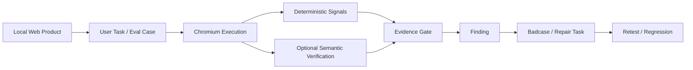
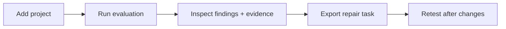
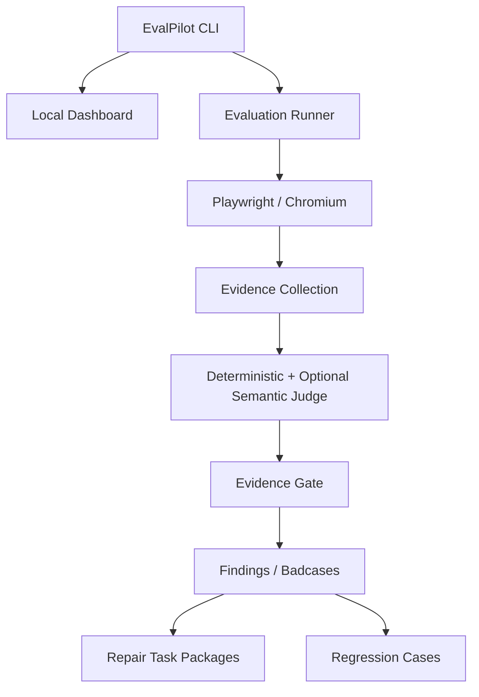

# EvalPilot Local — Evidence-First AI Product Evaluation for Web Apps

EvalPilot Local is a **local-first pre-release evaluation tool for web products**. It runs browser-based user tasks against a local app, captures reproducible evidence, classifies failures, and turns findings into repair-ready tasks for AI coding agents.

It is built for teams and individual builders who want to answer a practical question before shipping:

> **Can a user actually complete the important task — and if not, what evidence shows where it broke?**

**Core principles:** local-first, evidence before inference, deterministic signals before semantic judgment, and explicit boundaries around what AI is allowed to conclude.

> 本地运行 Web 产品评测，模拟用户完成关键任务，保存截图 / Trace / 控制台 / 网络证据，并将问题整理成可复测、可交给 AI 编码工具的修复任务。

**At a glance:** Local-first · Playwright / Chromium · Evidence Gate · Findings & Badcases · Regression · Agent handoff · Optional semantic verification

[Quick start](#quick-start) · [Evaluation model](#evidence-first-evaluation) · [Agent handoff](#agent-handoff) · [Benchmarks](#benchmark--claim-boundaries) · [Security](#ai-provider--api-key-safety)


## Why EvalPilot Exists

Vibe-coded and AI-assisted products often reach a state where the feature technically exists, but the experience is still unreliable:

- buttons work on the happy path but fail on edge cases;
- onboarding or multi-step tasks break midway;
- the UI and underlying product state disagree;
- an AI evaluator makes a plausible diagnosis without enough evidence;
- a fix is suggested, but nobody can reproduce the original failure or verify the regression.

EvalPilot treats product evaluation as an evidence pipeline rather than a one-shot LLM judgment.



## What It Evaluates

EvalPilot can exercise and inspect product behavior such as:

- page and route transitions;
- buttons, forms, dialogs, and other interactive controls;
- multi-step user journeys;
- expected vs. actual navigation paths;
- browser console and network failures;
- screenshots and Playwright Trace evidence;
- deterministic success signals;
- optional semantic verification for ambiguous UI states;
- regression of previously identified badcases.

Results distinguish **PASS**, **FAIL**, **BLOCKED**, and **NOT_APPLICABLE** instead of treating every missing capability as a product failure.

## Quick Start

Requires **Node.js 20.19.0+**.

```bash
npm install --global evalpilot-local@alpha
evalpilot doctor
evalpilot dashboard
```

If Chromium is missing:

```bash
evalpilot setup --install-chromium --confirmed
```

Then follow the Dashboard flow:



For a guided first run, see the [Public Alpha 15-minute test guide](docs/04-validation/PUBLIC_ALPHA_TEST_GUIDE.md).

## Evidence-First Evaluation

A Finding is not treated as trustworthy just because an AI model produced a convincing explanation.

EvalPilot separates:

1. **Execution evidence** — what the browser actually did;
2. **Deterministic signals** — route, DOM, control state, console/network evidence and explicit success conditions;
3. **Semantic interpretation** — optional model-assisted judgment when the state cannot be resolved deterministically;
4. **Evidence Gate** — whether the available evidence is strong enough to promote a candidate issue;
5. **Finding / Badcase** — the reusable failure description and regression target.

Low-confidence semantic output cannot independently turn a case into a confirmed product failure. When deterministic and semantic signals conflict, the system can report uncertainty rather than forcing a binary answer.

## Two Evaluation Paths

### Legacy Evaluation

The default Public Alpha workflow.

Best for builders who want a stable path from:

```text
Project → Evaluation → Findings → Evidence → Repair Task → Retest
```

It focuses on deterministic browser evaluation and evidence-rich reporting.

### Experimental Adaptive Evaluation

An experimental path for testing:

- AI-user style task execution;
- Evidence Gate behavior;
- adaptive Eval Set generation;
- semantic step verification;
- Product Understanding / Oracle generation;
- Finding → Badcase → Regression workflows.

This path does **not** imply that EvalPilot has reached reliable autonomous product evaluation. Candidate cases, incomplete evidence, or single low-confidence semantic failures do not increase verified coverage.

## Product Understanding

When explicitly enabled, EvalPilot can use a remote model to better understand the product's visible task structure.

The request is intentionally restricted to task-relevant context such as:

- routes;
- visible titles and navigation;
- buttons and forms;
- limited visible DOM context;
- documentation summaries.

It does not intentionally send source code, local secrets, full Playwright Trace archives, or complete project contents as part of that understanding step.

Any inferred business rule must remain reviewable rather than silently becoming ground truth.

## AI Provider & API Key Safety

Remote-model features are **optional** and used only when the user explicitly authorizes them for an experimental run.

Provide credentials through your shell environment:

```bash
export EVALPILOT_OPENAI_API_KEY="<your-api-key>"
export EVALPILOT_OPENAI_MODEL="<model-name>"
```

Never commit a real key to the repository.

The repository ignores local `.env*` files (except an optional `.env.example`) and common private-key formats. Standard GitHub CI uses a Mock Provider and does not require a real OpenAI credential.

### Data sent to a remote model

By default, EvalPilot minimizes remote context. Screenshots remain opt-in for a specific run. Trace archives stay local.

### Data kept local

- source code;
- local project files;
- screenshots unless explicitly authorized for the relevant model step;
- Playwright Trace archives;
- Evidence Packets;
- local evaluation data;
- credentials and tokens.

## Agent Handoff

EvalPilot is designed to produce repair context that an AI coding tool can act on without forcing the evaluator itself to become an autonomous code-changing agent.

A repair task can include:

- failing user task;
- exact failed step;
- target control or route;
- expected vs. actual behavior;
- screenshots / Trace / console / network evidence references;
- likely cause, clearly separated from confirmed evidence;
- suggested change area;
- retest acceptance criteria.

Public Alpha defaults to **task-package handoff** for Codex, Claude Code, Antigravity, and other coding agents. Automatic merge is not the default behavior.

## Benchmark & Claim Boundaries

The repository includes real-Chromium benchmark fixtures and tracks metrics such as:

- task completion rate;
- Recall;
- Precision;
- false-positive rate;
- issue classification;
- severity;
- failure source;
- uncertainty rate;
- repeated-run consistency.

Current deterministic Mock Actor benchmarks validate evaluator orchestration and judge behavior. They **do not represent real-model accuracy**.

Before claiming reliable autonomous evaluation, the roadmap requires external real-model validation to meet explicit quality gates, including Recall, Precision, false-positive rate, and failure-source accuracy thresholds.

See [ROADMAP.md](ROADMAP.md) for the current validation boundary.

## Privacy & Local-First Design

- Default data directory: `~/.evalpilot-local`
- Custom directory: `evalpilot --data-dir /path/to/data dashboard`
- Environment variable: `EVALPILOT_DATA_DIR=/path/to/data`
- EvalPilot does not intentionally read `.env` files, credentials, tokens, Agent conversations, or Claude session JSONL.
- Evaluation artifacts are not automatically uploaded.
- Browser exploration avoids destructive actions such as delete, payment, send, or publish by default.
- Share reports only after reviewing screenshots and visible page text for sensitive information.

See [SECURITY.md](SECURITY.md) for the full security boundary.

## Architecture at a Glance



The product is intentionally local-first: the browser, evidence store, reports, and task artifacts are designed to live on the user's machine unless a specific remote-model step is explicitly authorized.

## Common Commands

```bash
evalpilot --version
evalpilot doctor
evalpilot doctor --json
evalpilot dashboard
evalpilot dashboard --port 4180
evalpilot --data-dir /path/to/data dashboard
```

Lower-level CLI steps remain available for debugging the evaluation pipeline:

```text
init → scan → generate-background → generate-blueprint → generate-cases → run → report
```

## Development

```bash
git clone https://github.com/chusday97/evalpilot-local.git
cd evalpilot-local
npm ci
npm run check
npm test
npm run build
```

Useful evaluation-specific tests:

```bash
npm run test:ai-agent
npm run test:semantic-verifier
npm run test:product-understanding
npm run test:real-benchmark
```

Before publishing:

```bash
npm run audit:package
npm run test:consumer
```

## Current Status & Limitations

EvalPilot Local is currently **Public Alpha**. Repository source version: `0.6.0-alpha.0`.

Current boundaries include:

- macOS + Chromium is the formally validated environment;
- Linux support remains experimental;
- Windows is not yet a supported target;
- external real-model benchmark coverage is still incomplete;
- AI simulation and engineering evidence are not substitutes for real-user satisfaction or business metrics;
- adaptive evaluation remains experimental and should be reviewed alongside its evidence.

## Documentation

- [Public Alpha Test Guide](docs/04-validation/PUBLIC_ALPHA_TEST_GUIDE.md)
- [Security](SECURITY.md)
- [Roadmap](ROADMAP.md)
- [Contributing](CONTRIBUTING.md)
- [Support](SUPPORT.md)

## License

[MIT](LICENSE)
